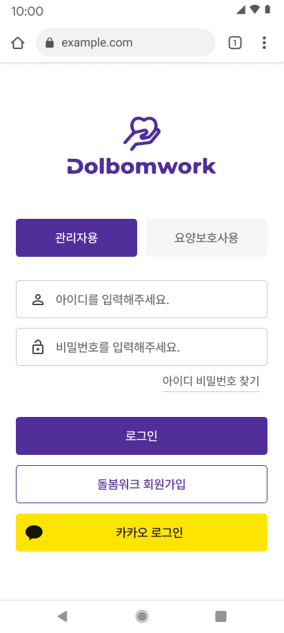
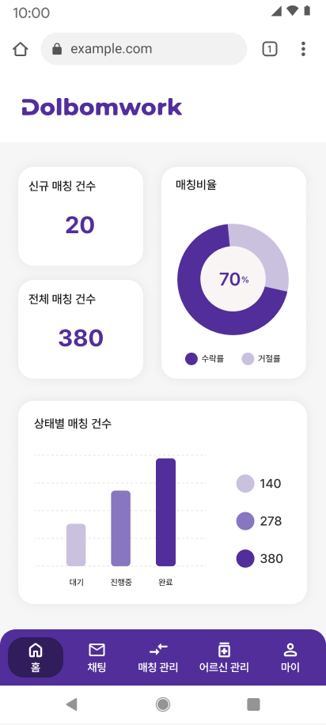
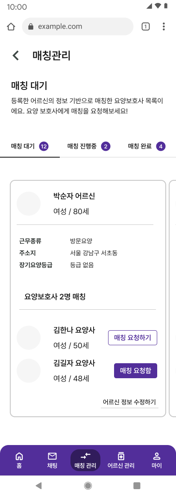

<!-- Header Banner -->
<div align="center">

  <!-- 로고 이미지 (GitHub에 업로드 후 경로 수정 필요) -->
  

  <br/><br/>

  ### 요양보호사와 돌봄이 필요한 분을 연결하는 스마트 매칭 플랫폼

  <br/>

  [](https://dolbom-work.co.kr)
  [](https://blaybus.notion.site/?pvs=73)
  [](https://future-level-ab5.notion.site/MVP-62e98829ddb54005a77c8e40ef270aa6)

</div>

<br/>

---

<br/>

## 🎯 프로젝트 소개

> **고령화 시대, 돌봄의 새로운 연결고리**

돌봄워크는 **요양보호사**와 **돌봄이 필요한 분(또는 보호자)** 을 효율적으로 매칭해주는 플랫폼입니다.
복잡한 구인/구직 과정을 간소화하고, 최적의 매칭을 통해 양질의 돌봄 서비스를 제공합니다.

<br/>

### ✨ 핵심 기능

<table>
  <tr>
    <td align="center" width="25%">
      <br/>
      <b>🤝 스마트 매칭</b>
      <br/><br/>
      <sub>요양보호사의 경력, 자격증,<br/>근무 조건을 분석하여<br/>최적의 매칭 제공</sub>
      <br/><br/>
    </td>
    <td align="center" width="25%">
      <br/>
      <b>💬 실시간 채팅</b>
      <br/><br/>
      <sub>WebSocket 기반<br/>실시간 채팅으로<br/>원활한 소통 지원</sub>
      <br/><br/>
    </td>
    <td align="center" width="25%">
      <br/>
      <b>📋 프로필 관리</b>
      <br/><br/>
      <sub>경력, 자격증, 근무조건 등<br/>상세 프로필로<br/>신뢰도 향상</sub>
      <br/><br/>
    </td>
    <td align="center" width="25%">
      <br/>
      <b>🏢 센터 관리</b>
      <br/><br/>
      <sub>요양 센터 운영을 위한<br/>통합 관리 기능<br/>제공</sub>
      <br/><br/>
    </td>
  </tr>
</table>

<br/>

---

<br/>

## 📱 서비스 미리보기

<div align="center">

  <!-- 스크린샷 이미지 (GitHub에 업로드 후 경로 수정 필요) -->
  
  &nbsp;&nbsp;
  
  &nbsp;&nbsp;
  

  <br/>
  <sub>로그인 &nbsp;&nbsp;&nbsp;&nbsp;&nbsp;&nbsp;&nbsp;&nbsp;&nbsp;&nbsp;&nbsp;&nbsp;&nbsp;&nbsp;&nbsp;&nbsp;&nbsp;&nbsp;&nbsp;&nbsp;&nbsp;&nbsp;&nbsp;&nbsp; 홈 대시보드 &nbsp;&nbsp;&nbsp;&nbsp;&nbsp;&nbsp;&nbsp;&nbsp;&nbsp;&nbsp;&nbsp;&nbsp;&nbsp;&nbsp;&nbsp;&nbsp;&nbsp;&nbsp;&nbsp;&nbsp;&nbsp;&nbsp;&nbsp;&nbsp; 매칭 관리</sub>

</div>

<br/>

---

<br/>

## 📦 저장소

<table>
  <tr>
    <th>Repository</th>
    <th>Description</th>
    <th>Tech Stack</th>
  </tr>
  <tr>
    <td>
      <a href="https://github.com/blaybus-hackathon/backend">
        <b>🔙 backend</b>
      </a>
    </td>
    <td>Backend API Server</td>
    <td>
      
      
      
    </td>
  </tr>
  <tr>
    <td>
      <a href="https://github.com/blaybus-hackathon/frontend">
        <b>🎨 frontend</b>
      </a>
    </td>
    <td>Frontend Application</td>
    <td>
      
      
    </td>
  </tr>
</table>

<br/>

---

<br/>

## 🛠 기술 스택

<div align="center">

### Backend


### Infrastructure


### Communication


</div>

<br/>

---

<br/>

## 📚 프로젝트 자료

<div align="center">

| 📄 문서 | 🔗 링크 |
|:------:|:------:|
| MVP 기획 문서 | [](https://future-level-ab5.notion.site/MVP-62e98829ddb54005a77c8e40ef270aa6) |
| 프로젝트 노션 | [](https://blaybus.notion.site/?pvs=73) |
| ERD 설계 | [](https://www.erdcloud.com/d/Ps5YSRwrTa7Jfwgk4) |
| WBS | [](https://www.notion.so/2025-195cfd33022780dcab69c54d21d85e1a?pvs=4) |

</div>

<br/>

---

<br/>

## 🚀 시작하기

### Backend

```bash
git clone https://github.com/blaybus-hackathon/backend.git
cd backend
./gradlew bootRun
```

👉 자세한 내용은 [Backend Documentation](https://github.com/blaybus-hackathon/backend/tree/main/docs)을 참고하세요.

### Frontend

```bash
git clone https://github.com/blaybus-hackathon/frontend.git
cd frontend
npm install && npm run dev
```

👉 자세한 내용은 [Frontend README](https://github.com/blaybus-hackathon/frontend#readme)를 참고하세요.

<br/>

---

<br/>

<div align="center">

  **Made with ❤️ by 은하수 개발단**

  <sub>Blaybus Hackathon 2025</sub>

</div>
